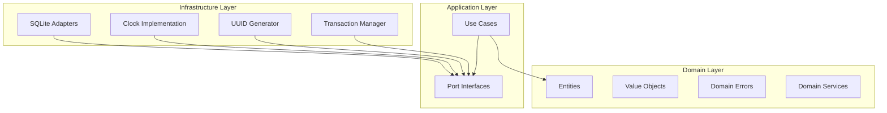
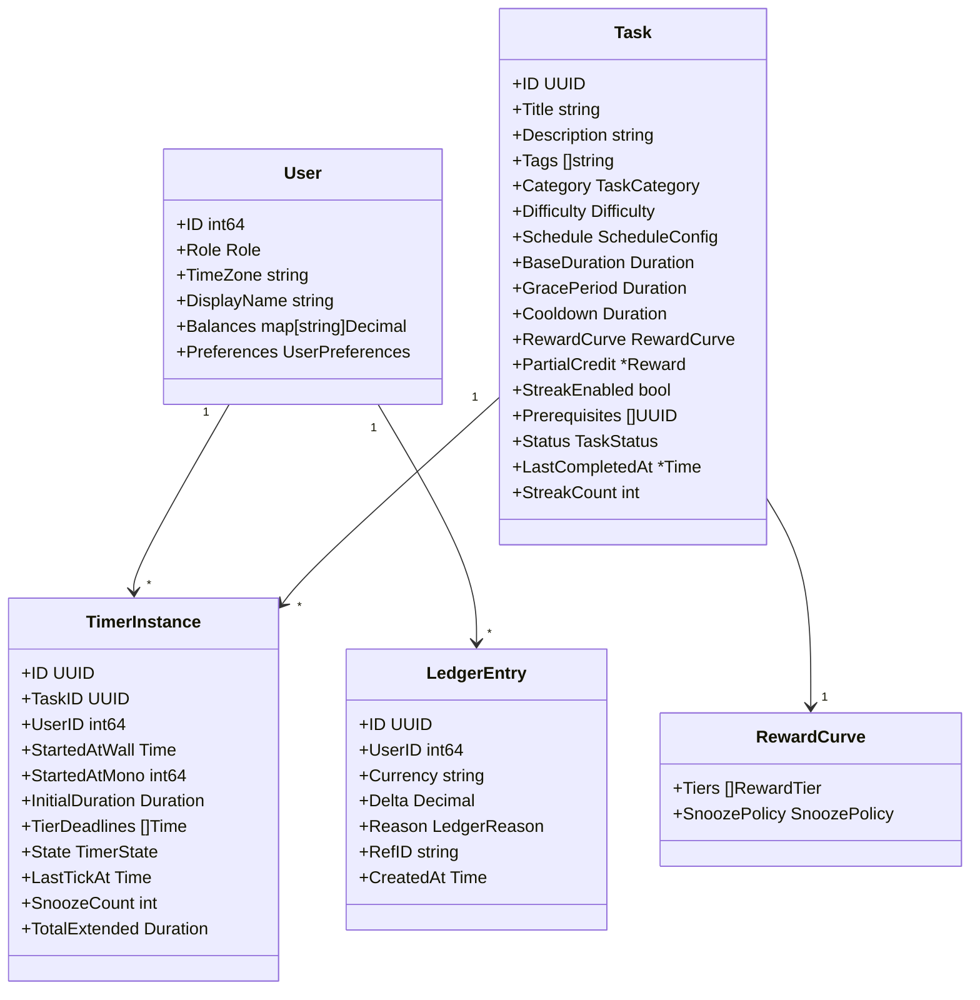
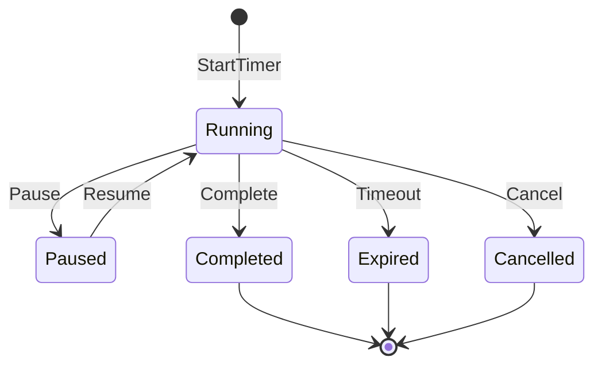
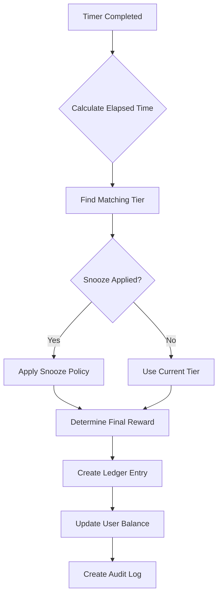

# ADHD Game Bot - Architecture Plan

## System Overview

This document outlines the architecture for the core domain system of the ADHD Game Bot, following Domain-Driven Design (DDD) and Clean Architecture principles.

## Architecture Layers



## Package Structure

```
/internal/
├── domain/
│   ├── entity/
│   │   ├── user.go
│   │   ├── currency.go
│   │   ├── task.go
│   │   ├── timer.go
│   │   ├── ledger.go
│   │   ├── redemption.go
│   │   ├── audit.go
│   │   └── schedule.go
│   ├── valueobject/
│   │   ├── reward_curve.go
│   │   ├── decimal.go
│   │   ├── schedule_config.go
│   │   └── timer_state.go
│   └── errors/
│       └── domain_errors.go
├── usecase/
│   ├── task_service.go
│   ├── timer_service.go
│   ├── reward_service.go
│   ├── store_service.go
│   └── scheduler_service.go
├── ports/
│   ├── repositories.go
│   ├── clock.go
│   ├── uuid.go
│   └── transaction.go
├── infra/
│   ├── sqlite/
│   │   ├── migrations/
│   │   ├── user_repo.go
│   │   ├── task_repo.go
│   │   ├── timer_repo.go
│   │   ├── ledger_repo.go
│   │   ├── redemption_repo.go
│   │   ├── audit_repo.go
│   │   ├── schedule_repo.go
│   │   └── tx_manager.go
│   ├── clock/
│   │   └── system_clock.go
│   └── uuid/
│       └── uuid_gen.go
├── scheduler/
│   ├── recurrence.go
│   └── occurrence.go
└── config/
    └── config.go
```

## Core Domain Model



## Key Workflows

### Timer Lifecycle



### Reward Calculation Flow



## Database Schema Design

### Core Tables

1. **users**
   - id (PRIMARY KEY)
   - role
   - timezone
   - display_name
   - preferences_json
   - created_at
   - updated_at

2. **currencies**
   - code (PRIMARY KEY)
   - name
   - decimals
   - conversion_rates_json

3. **tasks**
   - id (PRIMARY KEY)
   - title
   - description
   - category
   - difficulty
   - schedule_json
   - base_duration
   - grace_period
   - cooldown
   - reward_curve_json
   - partial_credit_json
   - streak_enabled
   - status
   - last_completed_at
   - streak_count

4. **timers**
   - id (PRIMARY KEY)
   - task_id (FOREIGN KEY)
   - user_id (FOREIGN KEY)
   - started_at_wall
   - started_at_mono
   - initial_duration
   - tier_deadlines_json
   - state
   - last_tick_at
   - snooze_count
   - total_extended
   - UNIQUE(task_id, user_id, state) WHERE state = 'Running'

5. **ledger**
   - id (PRIMARY KEY)
   - user_id (FOREIGN KEY)
   - currency (FOREIGN KEY)
   - delta
   - reason
   - ref_id
   - created_at
   - UNIQUE(reason, ref_id)

## Test Strategy

### Unit Tests (Domain Layer)
- Tier boundary calculations
- Snooze policy applications
- Decimal arithmetic precision
- Schedule recurrence logic
- Streak calculations

### Integration Tests (Repository Layer)
- CRUD operations
- Transaction atomicity
- Foreign key constraints
- Index performance
- Idempotency enforcement

### Acceptance Tests (End-to-End)
- Complete timer workflows
- Multi-currency transactions
- Schedule materialization
- Crash recovery scenarios

## Implementation Phases

### Phase 1A: Foundation
1. Project setup and structure
2. Domain entities and value objects
3. Port interfaces
4. Basic validation

### Phase 1B: Core Logic
1. Domain services
2. Use case implementations
3. In-memory test doubles
4. Unit test suite

### Phase 1C: Persistence
1. SQLite schema design
2. Migration scripts
3. Repository implementations
4. Integration tests

### Phase 1D: Advanced Features
1. Scheduler implementation
2. Transaction management
3. Idempotency mechanisms
4. Property-based tests

### Phase 1E: Polish
1. Acceptance test suite
2. Error handling refinement
3. Performance optimization
4. Documentation

## Key Design Decisions

1. **Monotonic Time for Timers**: Use monotonic clock for duration calculations to avoid wall clock adjustments affecting timer accuracy.

2. **Decimal Storage**: Store currency values as strings or scaled integers to avoid floating-point precision issues.

3. **Idempotency via RefID**: Every operation that affects state must include a reference ID for exactly-once semantics.

4. **Single Active Timer Rule**: Enforce at database level with partial unique index.

5. **Timezone Handling**: Store all times in UTC, convert to user timezone only for display/scheduling logic.

6. **Audit Everything**: Every state change creates an audit log entry for debugging and compliance.

## Error Handling Strategy

- Domain errors as typed errors (e.g., `ErrTimerAlreadyActive`)
- Repository errors wrapped with context
- Use case errors include operation context
- Validation errors with field-level details

## Performance Considerations

1. **Indices**:
   - ledger: (user_id, currency, created_at)
   - timers: (task_id, user_id, state)
   - schedule_occurrences: (task_id, user_id, due_at)

2. **Query Optimization**:
   - Batch balance updates
   - Materialized schedule views
   - Efficient streak queries

3. **Transaction Scope**:
   - Keep transactions small
   - Use optimistic locking where appropriate
   - Implement retry logic for conflicts